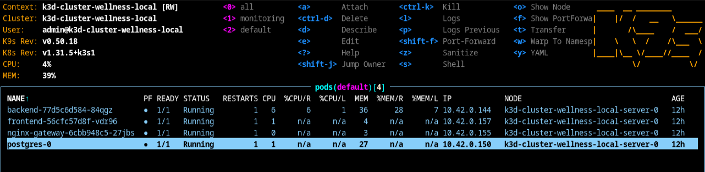
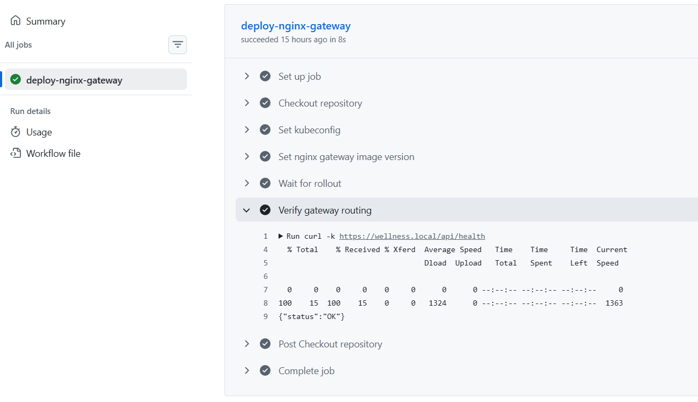
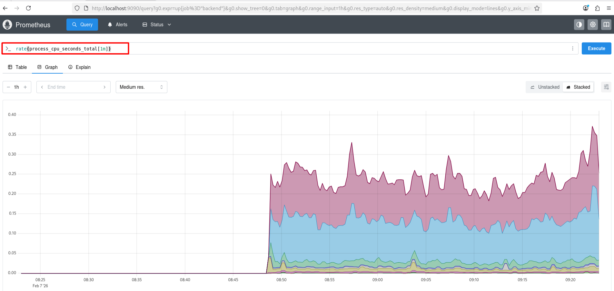
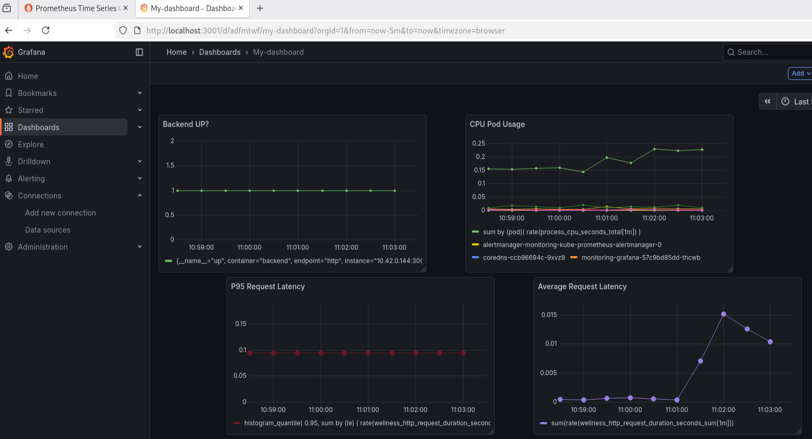
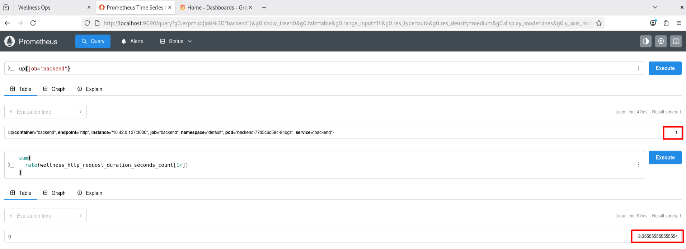

# 🧭 ¿Qué es esto?

Este proyecto es un entorno DevOps completamente containerizado y listo para producción, diseñado para demostrar prácticas modernas de infraestructura. Reúne Docker, Kubernetes, GitHub Actions, NGINX, TLS, monitoreo y un pipeline CI/CD completo para mostrar cómo una aplicación del mundo real se construye, se despliega y se opera de manera integral.

## ⚙️ ¿Qué hace?

Este sistema construye y despliega un backend en Node.js, sirve un frontend estático a través de una puerta de enlace NGINX, gestiona el tráfico utilizando un Ingress Controller y expone la aplicación de forma segura a través de TLS. También incluye pipelines de CI/CD automatizados, publicación de imágenes de contenedor, manifiestos de Kubernetes y una pila completa de monitoreo con Prometheus y Grafana.

 <p align="center">
  
</p>

---

## 🎯 Características principales


- ✅ Backend Node.js con rutas API y autenticación JWT
- ✅ Frontend estático (HTML/CSS/JS) servido a través de NGINX
- ✅ Base de datos PostgreSQL
- ✅ Docker Compose para desarrollo local
- ✅ Manifiestos de Kubernetes para orquestación en producción
- ✅ CI/CD con GitHub Actions (construcción y publicación automática de imágenes)
- ✅ Monitoreo con Prometheus e integración de métricas
- ✅ TLS con Let's Encrypt (o certificados autofirmados en desarrollo)
- ✅ MetalLB para equilibrio de carga en clusters bare-metal
- ✅ NGINX como controlador de ingreso y proxy inverso

---

## 📐 Arquitectura


## 🐳 Pods en ejecución




## 📊 Monitoreo


## 🔄 CI/CD - Integración Continua y Entrega Continua


Este pipeline automatiza completamente el despliegue de los servicios en Kubernetes, garantizando entregas rápidas y seguras.

**Cada vez que se publica una nueva versión o se ejecuta el workflow:**

- 🔧 Se actualiza la imagen del servicio en el clúster
- 🔄 Kubernetes realiza un rolling update sin interrupciones
- ⏳ Se espera a que el despliegue finalice correctamente
- ✅ Se verifica que la aplicación responde correctamente

👉 **Resultado:** Despliegues seguros, automatizados y sin tiempo de inactividad (zero downtime)




## 🚀 Integración Continua - Backend


Este proceso valida y compila el código del backend cada vez que se realiza un push o pull request.

**El flujo de integración continua del backend:**

- 🔍 Se ejecutan pruebas unitarias e integración
- 📦 Se construye la imagen Docker del servicio
- 🏗️ Se validan las configuraciones y dependencias
- 📤 Se etiqueta y prepara la imagen para publicar

👉 **Garantía:** Código validado, compilado y listo para ser desplegado en cualquier momento


## 📦 Despliegue/Entrega Continua


Automatiza la entrega y despliegue automático de las versiones compiladas en los ambientes correspondientes.

**El proceso de despliegue continuo:**

- 🐳 Se publica la imagen en el registro de contenedores (GHCR)
- 🔐 Se valida la firma y integridad de la imagen
- 📝 Se actualizan los manifiestos de Kubernetes
- 🚀 Se despliega automáticamente en el cluster de producción
- 📊 Se monitorean los logs y métricas post-despliegue

👉 **Beneficio:** Entregas automáticas, auditorables y con historial completo de cambios


## 📈 Pipelines


Visualización del estado y progreso de los pipelines CI/CD ejecutándose en GitHub Actions.

**Monitoreo de pipelines:**

- 📊 Estado en tiempo real de compilaciones
- ⏱️ Tiempo de ejecución de cada etapa
- ✅ Logs detallados de cada paso
- 🔄 Historial de ejecuciones y rollbacks
- 📧 Notificaciones automáticas en caso de fallos

👉 **Transparencia:** Visibilidad total del ciclo de vida de cada despliegue


## 📉 Prometheus


Sistema de monitoreo y base de datos de series temporales que recopila métricas del backend en tiempo real.

**Funcionalidades de Prometheus:**

- 📊 Recopilación automática de métricas del backend
- 💾 Almacenamiento de series temporales (TSDB)
- 🔍 Consultas avanzadas mediante PromQL
- 🚨 Alertas basadas en reglas personalizadas
- 📈 Retención configurable de datos históricos

👉 **Ventaja:** Datos de monitoreo confiables, durables y consultables para análisis



## 📊 Grafana


Plataforma de visualización que transforma los datos de Prometheus en dashboards interactivos y alertas visuales.

**Capacidades de Grafana:**

- 📈 Dashboards personalizados en tiempo real
- 🎨 Gráficos interactivos y tablas de datos
- 📲 Alertas visuales y notificaciones
- 👥 Control de acceso basado en roles (RBAC)
- 📊 Análisis de tendencias históricas

👉 **Resultado:** Visibilidad completa del estado y desempeño de la infraestructura



## 📌 Métricas


Métricas clave del sistema que proporcionan información sobre el desempeño, disponibilidad y salud de la aplicación.

**Métricas monitoreadas:**

- ⏱️ Latencia de respuestas (p50, p95, p99)
- 📊 Tasa de solicitudes por segundo (RPS)
- ❌ Tasa de errores (5xx, 4xx)
- 💾 Uso de memoria y CPU
- 🔄 Estado de conectividad de base de datos
- 📈 Throughput de transacciones

👉 **Propósito:** Información cuantifiable para tomar decisiones sobre escalabilidad y optimización



---

## 📚 Documentación


Para capturas de pantalla adicionales relacionadas con el proyecto y su ejecución, visite el siguiente enlace: [Guía de Kubernetes y Docker - wellness ops](docs/kubernetes-guide.pdf).

---

## 🔧 Instalación


Para instalar el proyecto en tu equipo, utiliza el siguiente comando que descargará una copia del repositorio completo desde Git.

### Requisitos previos

- Docker >= 24
- Docker Compose
- Kubernetes (k3d/kind/minikube)
- kubectl
- Helm

### En macOS o Linux

```shell
git clone https://github.com/luisrodvilladaorg/wellnes-ops.git
cd wellnes-ops
```

### Configurar variables de entorno

Crea las variables de entorno necesarias para el proyecto (ver archivo .env.example). Por razones de seguridad, no incluimos variables de entorno públicas.

Edita el archivo `.env` si es necesario

### Iniciar el stack con Docker Compose

Inicia la pila con Docker Compose (entorno de desarrollo) en segundo plano:

```shell
docker compose -f docker-compose.dev.yml up -d
docker ps
```

### Verificar que el backend está funcionando

```shell
docker logs wellness-backend-container
```

### Exponer el puerto interno 3000 del backend en el host

```shell
docker run -d -p 3000:3000 --name wellness-backend wellnes-ops-backend
```

### Pruebas funcionales

```shell
curl http://localhost:3000/api/health
```

---

## ☸️ Kubernetes (PRODUCCIÓN / Modo real)


### Crear cluster

```shell
k3d cluster create cluster-wellness-local
```

### Aplicar manifiestos

```shell
kubectl apply -R -f k8s/
```

### Verificar el estado

```shell
kubectl get pods
kubectl get svc
kubectl get ingress
```

### Acceder a la aplicación

```shell
curl -k https://wellness.local/api/health
```

**Actualiza tu archivo `/etc/hosts` agregando la siguiente entrada:**

```
127.0.0.1   wellness.local
```

El proyecto puede ejecutarse localmente usando Docker Compose para desarrollo, o desplegarse en Kubernetes para un entorno similar al de producción.

Para continuar con los pasos más avanzados sobre la instalación del controlador nginx ingress y certificados TLS, dirígete al archivo ubicado en `/docs/guide`

---

## 📊 Capas diferentes


```
                          ┌───────────────────────┐
                          │        Cliente        │
                          │   Navegador / Curl    │
                          └───────────┬───────────┘
                                      │
                               HTTPS (443)
                                      │
                    ┌─────────────────▼─────────────────┐
                    │   Controlador NGINX Ingress        │
                    │  (terminación TLS, enrutamiento)  │
                    └───────────┬───────────┬───────────┘
                                │           │
                           "/"  │           │  "/api/*"
                                │           │
          ┌─────────────────────▼───┐   ┌───▼─────────────────────┐
          │      nginx-gateway      │   │    API Backend            │
          │   (proxy inverso        │   │   Node.js / Express      │
          │    interno)             │   │   JWT · REST · Métricas │
          └───────────┬─────────────┘   └───────────┬─────────────┘
                      │                               │
                 HTTP │                               │ SQL
                      │                               │
        ┌─────────────▼─────────────┐     ┌──────────▼──────────┐
        │        Frontend            │     │    PostgreSQL        │
        │   Sitio Web Estático       │     │  StatefulSet + PVC   │
        │   (Nginx)                  │     │                      │
        └───────────────────────────┘     └─────────────────────┘

        ───────────────────────── Observabilidad ──────────────────────

                 ┌───────────────────┐     ┌───────────────────┐
                 │   Prometheus      │◄────│ Backend /metrics  │
                 │  (ServiceMonitor) │     │  (solo interno)   │
                 └─────────┬─────────┘
                           │
                           ▼
                     ┌───────────────┐
                     │   Grafana     │
                     │  Dashboards   │
                     └───────────────┘

        ───────────────────────── CI / CD ─────────────────────────

        ┌──────────────┐   compilar y push   ┌────────────────────────┐
        │   GitHub     │ ──────────────────► │  GHCR (Imágenes Docker)│
        │   Actions    │                     └───────────┬────────────┘
        └──────┬───────┘                                 │
               │ desplegar                               │ descargar
               ▼                                         ▼
        ┌─────────────────────────────────────────────────────────┐
        │              Cluster de Kubernetes                      │
        │         (Actualizaciones continuas y Rollback)          │
        └─────────────────────────────────────────────────────────┘
```

---

## 👤 Contribuidor


Luis Fernando Rodríguez Villada

luisfernando198912@gmail.com

https://luisops.com
