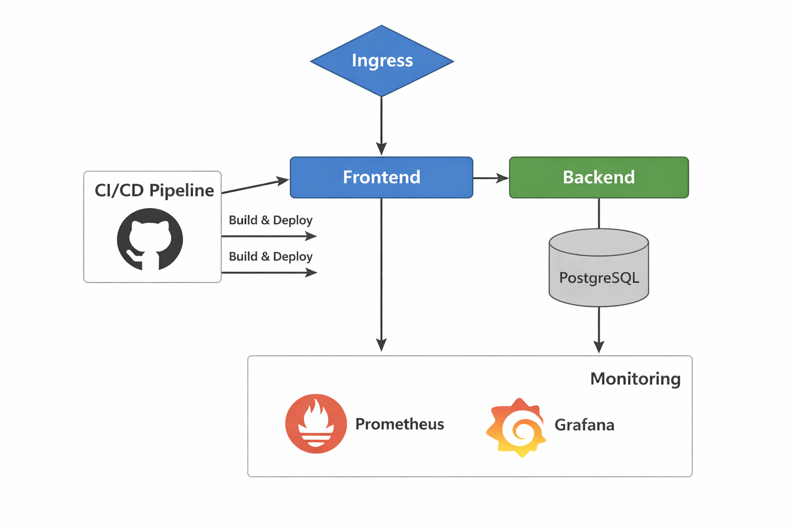

# wellness-ops

[](https://github.com/luisrodvilladaorg/wellnes-ops/actions/workflows/dev.yml)
[](https://github.com/luisrodvilladaorg/wellnes-ops/actions/workflows/prod.yml)
[](https://github.com/luisrodvilladaorg/wellnes-ops/commits/main)
[](LICENSE)

Main application repository and local/Kubernetes operations workspace.

## Quick Profile (Portfolio)

End-to-end DevOps project with a real separation between application code and GitOps desired state.

- Node.js backend + frontend + PostgreSQL deployed on Kubernetes.
- CI/CD with GitHub Actions and GitOps delivery with ArgoCD.
- `dev` and `prod` environments managed through Kustomize overlays.
- Secure exposure through NGINX Ingress Controller + TLS (`cert-manager`).
- Observability with Prometheus, Grafana, and `ServiceMonitor`.
- Production promotion flow based on semantic tag `v*.*.*`.
- Operational state validated in `dev` (backend/frontend/postgres running).

Result: a reproducible, traceable flow aligned with real cluster operations.

## Recruiter TL;DR

- Demo platform with `frontend + backend + PostgreSQL`.
- CI/CD with **GitHub Actions + ArgoCD (GitOps model)**.
- Repository split:
  - `wellnes-ops`: app code, Docker, workflows, documentation.
  - `wellness-gitops`: base/overlay manifests synchronized by ArgoCD.
- `dev` and `prod` environments via Kubernetes overlays.
- Exposure through **NGINX Ingress Controller** and TLS via `cert-manager`.
- Observability with Prometheus/Grafana and backend `ServiceMonitor`.

## What this project does today

- Builds frontend/backend images and publishes them to GHCR.
- Updates image tags in `wellness-gitops` from GitHub Actions.
- ArgoCD synchronizes desired state from the GitOps repository to the cluster.
- HTTP(S) routing through NGINX Ingress:
  - `/api` -> `backend-service`
  - `/` -> `frontend-service`

> Note: this README documents the current flow. Historical/lab files still exist in the repository (for example `nginx-gateway`) and do not represent the current primary deployment path.

## Architecture (current)



## CI/CD (current)

Main operational flow:

1. Push to `main` -> `dev.yml` workflow (build/push images + update `dev` overlays in `wellness-gitops`).
2. Tag `v*.*.*` -> `prod.yml` workflow (promote images from `dev` to `prod` overlays in `wellness-gitops`).
3. ArgoCD detects changes in `wellness-gitops` and syncs the cluster to the desired state in Git.

Flow documentation:

- [docs/deployment-flow.md](docs/deployment-flow.md)

## Current status (`dev` namespace)

Snapshot taken on **2026-03-21**:

- Pods: backend (2/2), frontend (1/1), postgres (1/1), init job completed.
- Services: `backend-service` (3000), `frontend-service` (80), `postgres-service` (5432).
- Deployments ready: backend (2 replicas), frontend (1 replica).

```bash
kubectl get all -n dev
```

## Observability

- Backend metrics are exposed and scraped by Prometheus via `ServiceMonitor`.
- Grafana dashboards are used for visualization.

> Alertmanager is not declared as a confirmed operational component in this primary repository.

## What this README does NOT claim

To avoid discrepancies, this README does not claim the following as implemented in `wellnes-ops`:

- Active Trivy scanning in pipelines (there is strategy/documentation, but no active integration in primary workflows).
- Terraform as operational IaC for this repository.
- NGINX gateway as the current primary frontend route.

## Local startup (`dev`)

```bash
git clone https://github.com/luisrodvilladaorg/wellnes-ops.git
cd wellnes-ops
docker compose -f docker-compose.dev.yml up -d
```

## Resources

- [docs/RUNBOOK.md](docs/RUNBOOK.md)
- [docs/deployment-flow.md](docs/deployment-flow.md)
- [docs/ingress-controller.md](docs/ingress-controller.md)
- [docs/observability-grafana-prometheus.md](docs/observability-grafana-prometheus.md)
- [docs/SECURITY.md](docs/SECURITY.md)

## Pending visual documentation

- Updated ArgoCD screenshots.
- Screenshots from the additional namespace (besides `dev`).

## License

Project distributed under [LICENSE](LICENSE).
