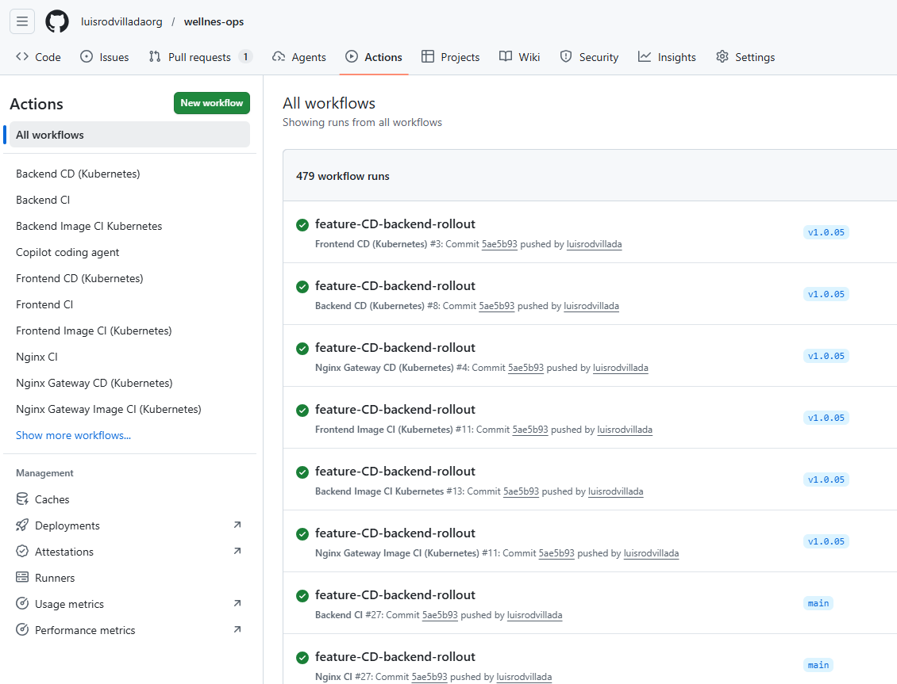

# 🚀 Deployment flow (dev, staging, prod)

Short version: the platform now runs a full three-environment GitOps flow from code change to Kubernetes rollout.

## ✨ At a glance

- **Source repo:** `wellness-ops`
- **GitOps repo:** `wellness-gitops`
- **Registry:** GHCR
- **Delivery model:** GitHub Actions + ArgoCD
- **Active environments:** `dev`, `staging`, `prod`

---

## 🧭 Pipeline map

### Quality gate (before merge)

- Trigger: Pull Request to `main`
- Workflow: [wellness-ops/.github/workflows/ci.yml](../.github/workflows/ci.yml)
- Actions: lint + tests + build + Trivy scan

### DEV continuous deployment

- Trigger: push to `main`
- Workflow: [wellness-ops/.github/workflows/cd-dev.yml](../.github/workflows/cd-dev.yml)
- Result:
    - builds backend/frontend images,
    - scans with Trivy,
    - pushes tags to GHCR,
    - updates `k8s/overlays/dev/*/patch-image.yml` in GitOps.

### STAGING release-candidate deployment

- Trigger: release-candidate tag `v*.*.*-rc.*`
- Workflow: [wellness-ops/.github/workflows/cd-staging.yml](../.github/workflows/cd-staging.yml)
- Result:
    - builds backend/frontend images,
    - scans with Trivy,
    - pushes RC tags to GHCR,
    - updates `k8s/overlays/staging/*/patch-image.yml` in GitOps.

### PROD promotion

- Trigger: stable tag `v*.*.*`
- Promotion source: production promotion workflow in GitOps repository
- Result: updates `k8s/overlays/prod/*/patch-image.yml` and lets ArgoCD reconcile production.

---

## ☸️ Runtime reconciliation

After each GitOps commit, ArgoCD detects the desired-state change and syncs the target environment namespace (`dev`, `staging`, or `prod`).

Kubernetes performs rolling updates through the existing Deployment strategy (`RollingUpdate`, readiness, liveness).

---

## 🖼️ Release path

```mermaid
flowchart LR
        A[PR to main] --> B[CI Quality Gate]
        B --> C[Merge to main]
        C --> D[CD DEV]
        D --> E[Tag v*.*.*-rc.*]
        E --> F[CD STAGING]
        F --> G[Tag v*.*.*]
        G --> H[CD PROD]
        H --> I[GitOps overlays updated]
        I --> J[ArgoCD sync]
        J --> K[Kubernetes rollout]
```

---

## 📸 Evidence placeholders

- TODO: add DEV pipeline + ArgoCD sync capture.
- TODO: add STAGING RC pipeline + ArgoCD sync capture.
- TODO: add PROD promotion + ArgoCD sync capture.

---

## ✅ One-line summary

**PR gate → dev deploy → staging RC deploy → prod promotion → ArgoCD sync → Kubernetes rollout**
